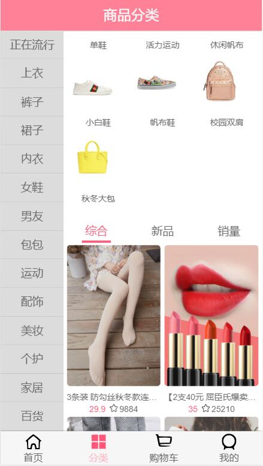
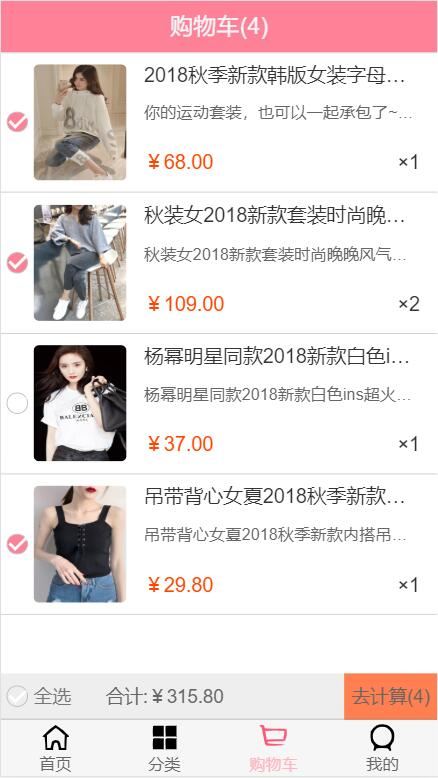

在b站看的王红元老师的Vuejs的课程跟着做的电子商城实战项目，老师的课程讲解中只有首页和购物车，自己完善了分类模块。由于Profile模块没有接口，基本都是css，就没有完成

**界面效果**

**1.主页**


**2.商品界面**


**3.分类界面**



**4.购物车**




课程地址：https://www.bilibili.com/video/BV15741177Eh?p=1

项目地址：https://github.com/coderwhy/HYMall

**注：接口可以加老师微信coderwhy003获取**

## Project setup
```
npm install
```

### Compiles and hot-reloads for development
```
npm run serve
```

### Compiles and minifies for production
```
npm run build
```

### Run your tests
```
npm run test
```

### Lints and fixes files
```
npm run lint
```

### Customize configuration
See [Configuration Reference](https://cli.vuejs.org/config/).
