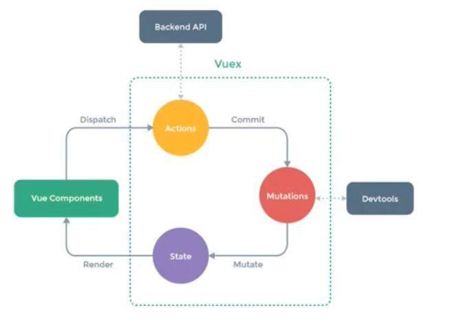
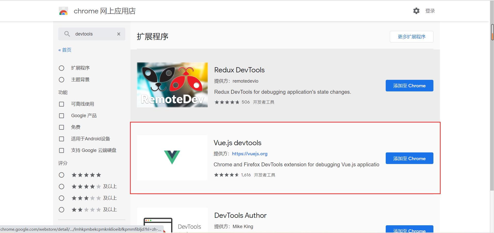
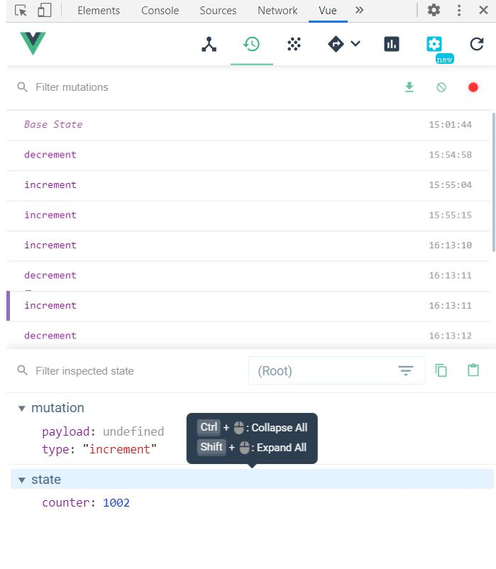
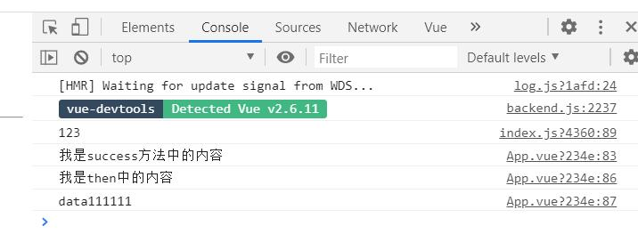

#Vuex
##Vuex是什么
官方解释：Vuex是一个专为Vue.js应用程序开发的**状态管理模式**，它采用**集中式存储管理**应用的所有组件的状态，并以相应的规则保证状态以一种可预测的方式发生变化，Vuex也集成到Vue的官方调试工具devtools extension，提供了诸如零配置的time-travel调试、状态快照导入导出等高级调试功能

状态管理模式、集中式存储管理可以理解为将需要多个组件共享的变量全部存储在一个对象里面，将这个对象放在顶层的Vue实例中，其他的组件可以共享使用。

当我们自己来封装管理这个对象时，并不能保证对象中所有的属性都做到响应式（要做到这一点比较麻烦），Vuex就是一个能够在多个组件之间共享状态的插件

##Vuex管理什么状态？
需要多个界面共享的状态，才放入Vuex中进行管理，例如用户的登陆状态、用户名称、头像、地理位置等等。父子组件之间的通信无需放入Vuex中进行管理

##Vuex的安装和使用
安装命令：npm install vuex --save

Vuex的使用方式同vue-router类似（插件的用法都比较类似），安装完成后，需要使用import语句导入Vuex

	import Vuex from 'vuex'
插件一般不能直接使用，需要调用Vue的use方法安装插件

	Vue.use(Vuex)
接着创建Vuex的实例对象

	const store = new Vuex.Store({
	    state:{
	        counter:1000
	    },
	    mutations:{
	
	    },
	    actions:{
	
	    },
	    getters:{
	
	    },
	    modules:{
	
	    }
	})
其中state中定义的为状态，即多个组件需要共享的变量；mutations中定义要修改状态（变量）的方法；actions中处理异步操作；getters类似于组件中的计算属性computed(当界面上想要直接展示一个数据时，可以在data中定义，当界面中展示的数据需要进行一系列的变化，那么可以用计算属性)；mudules是用于划分模块

最终将对象导出，并在main.js中引入、使用

	export default store
main.js

	import Vue from 'vue'
	import App from './App.vue'
	import store from './store/index'
	
	Vue.config.productionTip = false
	
	new Vue({
	  render: h => h(App),
	  store
	}).$mount('#app')
这时在全局就有了$store对象，在其它页面要引用counter的值时，可以通过下列语句获得

	$stroe.state.counter

##更改state中的值
要修改state中的数值，都是通过mutations修改，官方不建议直接从component修改State的值，因为只有通过mutations修改的值，才能被devtools跟踪，devtools会跟踪每一次State值得改变。官方允许直接通过components到mutations修改State的值，但是这样是同步操作，当有异步操作时（发送网络请求），要通过action操作完成后再将值提交到mutations中

在使用devtools之前，需要对浏览器添加Vue.js devtools扩展程序

对于在state中定义的变量counter，在mutations定义其更改的方法，mutations中定义的方法自带一个参数state，其指向同一个Vuex中定义的state，因此在方法中想要获取state中定义的counter直接使用state.counter即可，且可对该变量做出修改

	mutations:{
        //方法
        increment(state){
            state.counter++
        },
        decrement(state){
            state.counter--
        }
    }

在其他的组件中，要调用该方法时，可以通过this.$store拿到main.js中注册的store对象，并调用该对象的commit方法，该方法需要一个字符串类型的参数，该参数与mutations中定义的方法同名，即可扫描到mutations中对应的方法，并执行。例如

	methods:{
	    add(){
	      this.$store.commit('increment')
	    },
	    sub(){
	      this.$store.commit('decrement')
	    }
	  }
当调用了add方法时，便会去store对象的mutations中查找increment方法，并执行。同理，调用sub方法时，会执行decrement方法。

通过了mutations中的方法所更改的状态(变量)，插件devtools可以跟踪到，它会记录每一次状态的变化

##State单一状态树
单一状态树也成为单一数据源，当多个组件所需要的状态信息保存到了多个Store对象中，在之后管理和维护将会变得非常困难，因此Vuex使用单一状态树来管理应用层级的全部状态。换句话来说，官方不建议同一项目中创建多个Vuex实例

##vuex-getters
Vuex中的getters相当于单一组件中的计算属性computed，即当Vuex中定义的数据的数据需要经过一番处理在进行显示，可以将其定义在getters中。例如对于state中定义的students数组：

	students:[
            {
                id:10,
                name:'zs',
                age:18
            },
            {
                id:11,
                name:'ls',
                age:16
            },
            {
                id:19,
                name:'ww',
                age:22
            }
        ]
要在页面中显示年龄大于20岁的学生，可以在getters中定义方法

	more20stu(state){
            return state.students.filter(s=>{
                return s.age>=20
            })
        }

在页面中使用时，获取getters中的more20stu即可

	<h2>{{ $store.getters.more20stu }}</h2>

getters中定义的计算变量可以有两个参数，第一个为当前Vuex的state，第二个为当前Vuex的getters，因此在要计算年龄大于20岁的学生个数时，可以直接使用getters中的计算变量more20stu

	more20stuLength(state,getters){
            return getters.more20stu.length
        }

以上的两种操作都是利用固定值20来过滤要得到学生，当想要指定值，例如年龄大于15时，应当如何实现？

getters中定义的计算变量最多只有两个参数，state和getters，不能够自定义其他的变量，因此可以返回一个函数，该函数中可以自定义参数，并通过参数进行过滤

	moreAgeStu(state){
            return function (data) {
                return state.students.filter(s=>{
                    return s.age >= data
                })
            }
        }
使用箭头函数可简化为：

	moreAgeStu(state){
            return data=> state.students.filter(s=>  s.age >= data)
        }
在页面中使用

	<h2>{{ $store.getters.moreAgeStu(15) }}</h2>

其中$store.getters.moreAgeStu返回为一个函数function，function方法参数data对年龄进行过滤

##vuex-mutations
要修改store中的state，一定要经过mutations进行修改

	mutations:{
        //方法
        increment(state){
            state.counter++
        },
        decrement(state){
            state.counter--
        }
    }
其中increment部分是时间类型，(state)及以后的内容为回调函数

mutations中支持携带参数进行修改。例如调用方法并传入数字，使state中的counter加上这个数字，那么在mutations中方法定义为

	incrementCount(state,count){
            state.counter += count
        }
其中后面的参数count就是需要累加的参数

在组件中的方法定义为

	addCount(count){
      this.$store.commit('incrementCount',count)
    }
在使用commit提交时，不仅要传入方法名称，还要传入方法需要的参数。当然，方法的参数也可以是一个对象。

##vuex-actions
在mutations中不要做异步操作，因为mutations中的异步操作虽然可以在页面更改，但是devtools无法追踪。Action使类似于mutation的，但是action是用来代替mutation进行异步操作的

在actions中定义的方法也有一个默认参数（mutations中默认参数为state，getters中默认参数为state和getters），该参数一般命名为context，表示store对象。同mutations一样，actions中的方法也可以自定义参数，除context外还可以定义其他的参数

###普通调用
前面有强调，要修改state中变量的值，必须通过mutations，因此在actions中要修改state中的值，也必须使用commit来调用mutations的方法（setTimeout模拟异步操作）

	aUpdateInfo(context,payload){
            setTimeout(()=>{
                context.commit('updateInfo')
                console.log(payload);
            },1000)
        }
actions中方法的调用方式和mutations中略不同，mutations中的方法使用commit提交，而actions中的方法使用dispatch转发

	updateInfo(){
      // this.$store.dispatch('aUpdateInfo')

      //在调用方法时，可以传递参数，例如payload
      this.$store.dispatch('aUpdateInfo','我是payload')
    }

###异步拿到数据后调用
当某些操作是要在异步操作拿到数据后才能完成时，以上普通的操作方式当然无法完成，这时我们可以用Promise来完成操作

在actions的方法中，直接返回Promise实例，在Promise中执行相应的异步操作，并可以将异步操作得到的数据传入resolve，在Promise中执行了resolve函数后，将会带着resolve中的数据去寻找对应的then方法，并执行

	aUpdateInfo1(context,payload){
            return new Promise((resolve, reject)=>{
                setTimeout(()=>{
                    console.log(payload.message);
                    payload.success()
                    resolve('111111')
                },1000)
            })
        }

由于aUpdateInfo1所返回的数据是一个Promise实例，因此在App.vue中调用时，dispatch所返回的就是该Promise实例，那么在调用了resolve('111111')函数后要执行的then方法可以在dispatch拿到的返回的Promise对象后编写。

	updateInfo1(){
      this.$store.dispatch('aUpdateInfo1',{
        message:'123',
        success:()=>{
          console.log('我是success方法中的内容');
        }
      }).then(data =>{
        console.log('我是then中的内容');
        console.log('data'+data);
      })
    }

##vuex-modules
如果将所有的状态全部定义在state中，且在实际开发中推荐使用单一状态树，即只有一个store，也就是只有一个state，那么state将变得非常臃肿

为了解决这个问题，vuex为我们提供了modules，modules可以将store分模块来管理，在modules中的一个模块中，又可以定义state、mutations、actions、getters和modules（嵌套在内部的modules很少使用，一般只嵌套一层）

	modules:{
        a:{
            state:{
				name:'kobe'
            },
            mutations:{

            },
            getters:{

            },
            actions:{

            }
        }
	}
###modules中的state
modules中的state在使用时，取值方式如下

	<h2>{{ $store.state.a.name }}</h2>
因为在modules中定义的内容自动被放入了最外层的state中

###modules中的mutations
mudules中的mutations依然保持以最普通的方式提交，且modules中的mutations不要与store中的mutations中的方法重名

###mudules中的getters
mudules中的getters在没有传入其他的getters时，调用方式仍然保持普通的方式，在引用了其他的getters时，直接拿到的getters为同一模块中的getters。在modules中的getters还可以传入第三个参数，rootState，rootState就表示store中的state

	getters:{
                getName(state){
                    return state.name
                },
                getFullName(state,getter,rootState){
                    return state.name+getName.getName()+rootState.name
                }
            }

###modules中的actions
在前面将结果，store中的action所定义的方法中，默认有个context参数，代表store对象，同样在，modules的action中定义的函数也有默认的参数context，该context代表的是自己所在的module对象

**vuex中的各个模块，以及stroe中的mutations，actions，getters等等都可以封装成单独的js文件进行管理，在创建store的js文件中导入即可**