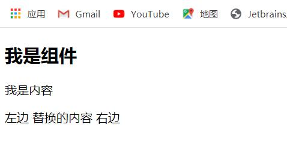

**这个学习笔记不是看的王红元老师的，但是知识点类似，就一并提交上来了**
#el：挂载点
Vue实例的作用范围是什么？

	Vue会管理el选项命中的元素及其内部的后代元素
是否可以使用其他的选择器？

	可以使用其他的选择器，但建议使用ID选择器
是否可以设置其他的dom元素呢？

	可以使用企业他的双标签，不能使用HTML和BODY

#data：数据对象
data数据对象有哪些要点？

	Vue中用到的数据定义在data中
	data中可以写复杂类型的数据
	渲染复杂类型的数据时，遵守js的语法即可
#指令
##内容绑定，事件绑定
###v-text
用于设置标签的文本值（textContent），例如

	<h2 v-text="message"></h2>
那么h2标签中的文本值将全部被data设置的message值替换

不想全部被替换可使用{{message}}的方式或者使用

	<h2 v-text="message+'!'"></h2>
在单引号中添加内容
###v-html
用于设置元素的innerHTML

	

当内容中有html结构时，将会被解析为标签，例如：

	content:"<a href=\'#\'>hello vue</a>"
会被解析为a标签

v-text中无论文本内容是什么，只会解析为文本，例如使用

	

则data中的content会被直接解析为文本引号中的文本
###v-on
用于为元素绑定事件

	v-on:click="方法"：鼠标点击事件
	v-on:mouseenter="方法"：鼠标移入事件
	v-on:dblclick="方法"：双击事件
“v-on:”可以被替换为“@”，例如：

	@click="方法"
	@mouseenter="方法"
	@dblclick="方法"
“v-on”绑定的方法定义在methods属性中，在方法内部可以通过this关键字访问定义在data中的数据
##显示切换，属性绑定
###v-show
用于根据表达值的真假，切换元素的显示和隐藏，原理是修改元素的display，实现显示隐藏，v-show指令后的内容，最终都会被解析为boolean值，为true时元素显示，为false时元素隐藏

	
	
根据v-show的值决定是否显示图片，也可通过data和methods修改data中的值来改变状态
###v-if
根据表达式的真假，切换元素的显示和隐藏（操纵dom元素）

用法和v-show类似

v-show和v-if的区别：v-show改变的是display，v-if改变的是dom树，将元素从dom树中直接移除
###v-bind
用于设置元素的属性

	v-bind:属性名=表达式
	
imgSrc的值在data中指定

“v-bind:”可直接简写为“：”，上式改写为：

	
	
##列表循环，表单元素绑定
###v-for
根据数据生成列表结构

数组经常和v-for结合使用，语法是

	(item,index) in 数据
	v-for="(item,index) in objArr"
index代表索引，item代表数据中的每一项，item和index可以结合其他的指令一起使用，数组长度的更新会同步到页面上，是响应式的
###v-on补充
传递自定义参数，事件修饰符

事件绑定的方法写成函数调用的形式，可以传入自定义参数，定义方法时需要定义形参来接收传入的实参

事件后面跟上**.修饰符**可以对事件进行限制，例如：

	<input type="text" @keyup.enter="sayHi"/>
表示限制触发的按键为回车

更多参考文档：https://cn.vuejs.org/v2/api/#v-on
###v-model
获取和设置表单元素的值（双向数据绑定）

绑定的数据会和表单元素值相关联

绑定的数据<-->表单元素的值

	<input type="text" v-model="message"/>
	<h2>{{ message }}</h2>

	data:{
            message:"hello Vue"
        }
message中的值会同步更新，当data中message的值改变时，显示在text的值也会改变，当text的值改变时，同步更新data中message的值，因此再h2标签中的值也会同步更新
#网络应用
##axios
axios必须先导入再使用

	
使用get或post方法即可发送对应的请求，then方法中的回调函数会在请求成功或失败时触发，通过回调函数的形参可获取响应内容或错误信息

参考文档：https://github.com/axios/axios

##axios+vue
axios回调函数中的this已经改变，无法访问到data中的数据，因此要在axios中获取或改变data中的数据时，先将this保存起来，回调函数中直接使用保存的this即可。
#组件化开发
##组件化的基本使用
使用Vue的extend方法创建组件构造器对象，使用Vue的component方法注册组件，并在页面引用组件

	//1.创建组件构造器对象
    const cpnC = Vue.extend({
        template:`
        

            <h2>我是标题</h2>
            
我是内容1

            
我是内容2

        
`
    })

    //2.注册组件
    Vue.component('my-cpn',cpnC)
在页面中使用<my-cpn></my-cpn>引用组件
##全局组件和局部组件
直接使用Vue.component注册的组件为全局组件，在Vue内部的components属性为局部组件

	//2.注册组件(全局组件)
    Vue.component('my-cpn',cpnC);

	const app = new Vue({
        el:"#app",
        data:{
        },
        components:{
            //在Vue中注册的为局部组件
            cpn:cpnC
        }
    });
#父组件与子组件
在组件内部的components属性中引入其他的组件，成为父子组件

	//2.创建第二个组件（父组件）
    const cpnC2 = Vue.extend({
        template:`
        

            <h2>我是标题2</h2>
            
我是内容2

            <cpn1></cpn1>
        

        `,
        //子组件
        components:{
            cpn1:cpnC1
        }
    });
##语法糖和模板分离写法
可以直接将extend中的内容写在component中，其内部原理依然是使用extend来创建组件，再将创建的组件传递给component用于注册组件

	Vue.component('cpn1',{
        template:`
        

            <h2>我是标题1</h2>
            
我是内容1

        

        `
    });
这种写法的嵌套层次较多，可读性较差，因此可以使用组件模板来定义组件内容。分为两种方式

1.scrip标签（不常用）

script的类型必须是text/x-template，不然无法生效

	
2.template标签（常用）

	<template id="cpn">
	    

	        <h2>我是标题</h2>
	        
我是内容,template

	    

	</template>
注册组件时使用id选择器完成绑定

	Vue.component('cpn',{
        template: '#cpn'
    })

##组件中的data为什么是函数（重点）
https://www.bilibili.com/video/BV15741177Eh?p=57

每个组件中可以使用data来管理自己的数据，但是组件中的data是函数而非对象，因为组件可以重复使用，如果使用对象data，则改变其中一个组件中的值，其余的组件也会跟着改变，为了使不同的组件之间互不影响，Vue将组件中的data的作为函数，在页面中引用组件实例时，即使使用同一个组件，每个组件也是一个独立的组件个体，各自内部数据的改变不会影响其他的组件。详细内容见上面视频

要使对象之间相互影响时，可以在外部定义一个对象，其中声明了组件中需要的变量，在组件的data()函数中返回该对象。

	//组件间相互影响
    const obj = {
        num:0
    }

	data(){
        return obj
    },

##组件通信
###父组件向子组件传值
使用props，具体的流程如下

在父组件的data中定义了子组件中要显示的值movies和message

	const app = new Vue({
        el:'#app',
        data:{
            movies:['海王','海贼王','葫芦娃'],
            message:'Hello'
        },
        components:{
            //cpn:cpn的增强写法
            cpn
        }
    })

在子组件中的props属性中，定义对应的要引用的变量名（变量名可以自己定义），这里使用的是cmovies和cmessage（或使用cMovies和cMessage）

	const cpn = {
        template:'#cpn',
        props:['cmovies','cmessage'],
        data(){
            return{
            }
        }
    }
在引用组件中，使用v-bind来绑定props定义的名称，其中的值为父组件中定义的数据（Vue不支持驼峰，若以上定义为cMovies，在这里绑定也为cMovies，数据将显示不出来，可以用‘-’来区分，如c-movies）

	<cpn v-bind:cmovies="movies" :cmessage="message"></cpn>
在子组件中，使用子组件的props定义的变量名（子组件中显示可以用大写cMovies）

	<template id="cpn">
	    

	        
{{ cmovies }}

	        
{{ cmessage }}

	    

	</template>
最终将在页面显示

props可以为数组，对象等，作为对象时，可以限制其中每个变量的类型

	props:{
        //1.类型限制
        cmovies:Array,
        cmessage:String,

        //2.提供一些默认值
        cmessage1:{
            type:String,
            default:'zs'
			//为true是，说明在使用这个cpn组件时，必须传入cmessage1
            //required:true
        }
		//类型是对象或者数组时，默认值必须是一个函数defaut()
        cmovies1:{
            type: Array,
            default(){
                return['zs','ls','ww']
            }
        }
    },
具体如图所示：

###子组件向父组件传值
子组件向父组件传值需要使用自定义事件完成，当子组件中有事件需要监听时，例如button的click事件：

	<template id="cpn">
	    

	        <button v-for="item in categories"
	                @click="btnClick(item)">{{ item.name }}</button>
	    

	</template>
为了能使父组件能够响应，需要在子组件中使用$emit将事件发出，发出的事件带有参数时，直接跟在$emit函数后

	btnClick(item){
        //console.log(item);
        //用$emit发射事件,事件类型自定义，不能用大写
        this.$emit('item-click',item)
    }
在父组件中使用v-on来监听子组件事件

	<cpn @item-click="cpnClick"></cpn>
在注册的父组件中编写响应的方法来处理事件

	cpnClick(item){
        console.log('cpnClick');
        console.log(item);
    }
###父子组件的访问方式
####父组件访问子组件
使用$children或者$ref

**$children:（适用于获取所有的子组件，不常用）**

在父组件的方法中调用this.$children方法会获得当前父组件中所有的子组件，可以通过for(let c of this.$children)来遍历其中所有的子组件，但这种方式只适用于要获取所有的子组件的情况，要定位到其中指定的子组件时较困难

	

	    <cpn></cpn>
	    <cpn></cpn>
	    <cpn ref="a"></cpn>
	    <button @click="btnClick">按钮</button>
	

	btnClick() {
        // 1.$children
        console.log(this.$children);
        // this.$children[0].showMessage();
        for(let c of this.$children){
             console.log(c.name);
             c.showMessage();
        }
	}

**$refs:(适用于定位到指定的子组件)**

在使用refs定位到指定的子组件时，需要在子组件的引用中添加ref属性，并命名

	<cpn ref="a"></cpn>
在父组件的方法中使用this.$refs.a的方式来定位到该子组件

	btnClick(){
        this.$refs.a.showMessage();
    }

####子组件访问父组件
访问父组件时使用$parent

访问根组件时使用$root，用法和父组件访问子组件类似

#组件高级
##插槽slot
###插槽的基本使用
使用slot标签预留插槽

	<template id="cpn1">
	    

	        <h2>我是组件1</h2>
	        
我是内容1

	        <slot></slot>
	    

	</template>
在父组件中引用该子组件时，将在标签内部填充插槽中的内容

	

        <cpn1> <button>按钮</button> </cpn1>
        <cpn1> 我是cpn1中的span </cpn1>
        <cpn1>
            <li>我是cpn1中的li</li>
            
我是cpn1中的div

        </cpn1>
        <!--未添加内容，不显示-->
        <cpn1></cpn1>
    

插槽中可以指定默认值

	<template id="cpn2">
	    

	        <h2>我是组件2</h2>
	        
我是内容2

	        <!--组件中未指定时，默认为按钮-->
	        <slot> <button>按钮</button> </slot>
	    

	</template>
在父组件引用该子组件时，若未定义插槽的内容，则默认为子组件中定义的内容，若父组件中定义了插槽的内容，则该内容将会被替换

	

        <!--默认插槽中内容分为按钮-->
        <cpn2></cpn2>
        <cpn2><li>我是cpn2中的li</li></cpn2>
        <cpn2>是我cpn2中的span</cpn2>
        <!--默认插槽中内容分为按钮-->
        <cpn2></cpn2>
    

###具名插槽
在插槽的基本使用中，只使用了一个插槽，实际页面中，可能一个模板会存在多个插槽，直接替换无法定位到要替换的插槽是哪一个，因此可以为插槽添加name属性用于指定名称

	<template id="cpn">
	    

	        <h2>我是组件</h2>
	        
我是内容

	        <slot name="left"> 左边 </slot>
	        <slot name="center"> 中间 </slot>
	        <slot name="right"> 右边 </slot>
	    

	</template>
在父组件中使用子组件时，在标签中添加slot属性，属性值为插槽的名称，以定位到要替换的插槽(现在官方推荐使用v-slot，slot废弃但保留使用)

	<cpn> 替换的内容 </cpn>
页面显示为

