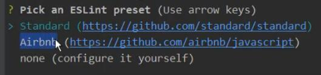
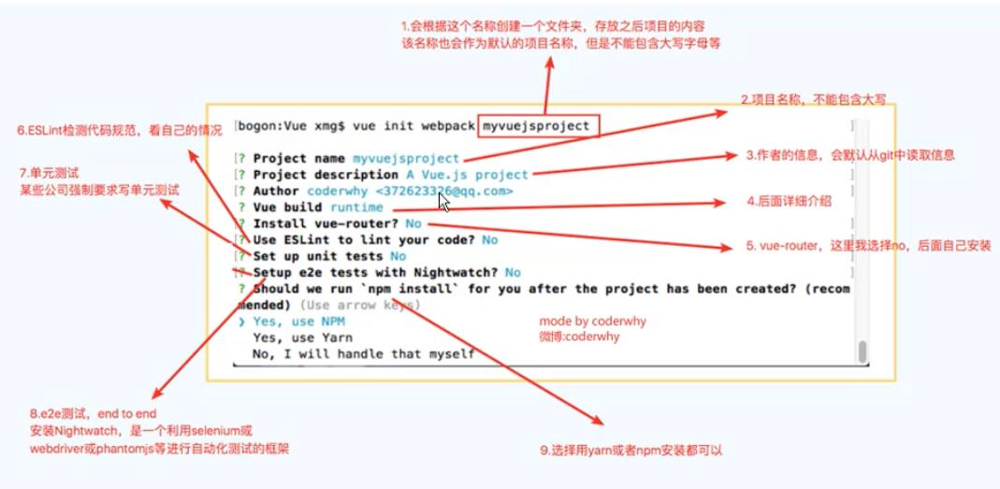
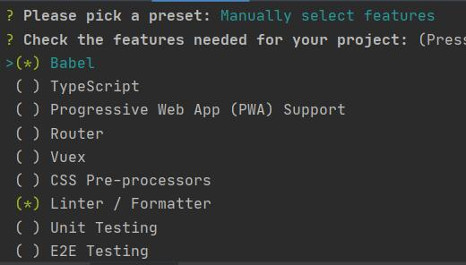

CLI是Command-Line Interface，翻译为命令行界面，俗称脚手架

Vue CLI是官方发布的vue.js项目脚手架，使用vue-cli可以快速搭建Vue开发环境以及对应的webpack配置

#Vue CLI
##脚手架安装
略过
##使用vue cli2创建项目
命令： vue init webpack 项目名称（不要有中文）

	vue init webpack vuecli2test
回车后生成：

**问题1**：project name （项目文件夹的名称，一般情况下直接回车生成和“项目名称”一样的文件夹）

**问题2**：project description（项目的描述，默认为“A vue.js project”，可以自己定义）

**问题3**：author（作者，默认是git的作者）

**问题4**：选择构建项目时的webpack是使用runtime+compiler还是runtime-only（runtime-only时，部分内容无法编译）

**问题5**：install vue-router（Y/n）（是否安装vue路由）

**问题6**：use ESLint to lint your code?(Y/n)（是否使用ESLint限制代码），如果选择了yes，会要求选择一种规范

ESLint=ES(js)+Lint 限制js代码的规范性，当js代码不规范时，编译将无法通过

**问题7**：set up unit test?(Y/n)（是否集成单元测试，用的较少）

**问题8**：setup e2e tests with Nightwatch?(Y/n)（是否集成e2e（end to end端到端）测试）

**问题9**：选择在以后管理项目时，使用npm命令还是yarn命令，或者自己定义（例如cnpm）

###runtime compiler和runtime-only的区别
两者创建的区别主要在main.js中，在runtime compiler中，引用模板的方式为：

	new Vue({
		el:'#app',
		template:'<App/>',
		components:{ App }
	})
它生成ui界面将会经历下面几个过程：template→ast→render→vdom→UI

runtime-only引用模板的方式为：

	new Vue({
		el:'#app',
		render:h => h(App)
	})
等价于

	new Vue({
		el:'#app',
		render:h => h(App)
	})
它在生成ui界面时会经历下面几个过程：render→vdom→UI

因此runtime-only相较于runtime compiler性能更高，代码量更少，占用资源更少

##使用cli3创建项目
命令：vue create testvuecli3

回车后生成：

**问题1**：please pick a preset（配置）? default或者Manually select features（选择配置，默认配置或手动配置）

**问题2**：

终端显示多个配置选项，按空格可选中

**问题3**：Where do you prefer placing config for Babel, PostCSS, ESLint, etc.?（您希望将配置文件存放于何处）

In dedicated config files（独立的配置文件）

In package.json（存放于package.json中）

**问题4**：Save this as a preset for future projects?（是否将配置保存为未来的项目的配置）

**问题5**： Save preset as（配置保存的名字，可以自己定义）

##ES6箭头函数
###箭头函数的使用
箭头函数是定义函数的一种方式，箭头函数最是函数定义的一种语法糖，类似与Java中的lambda表达式，箭头函数表示的规范写法为：

	const demo = (参数列表)=>{
		函数代码块
	}
当参数列表中只有一个参数时，可以将小括号省略，例如：

	const demo = num =>{
		return num*num
	}
在调用时，传入一个参数即可：demo(2)

当函数代码块中只有一行代码时，可以将大括号省略，例如：

	const demo = (num1,num2) => num1+num2
箭头函数将执行的结果返回，例如demo(2,3)执行的结果为5

当函数中只有一行代码，且无返回值时，例如：

	const demo = () => console.log('hello')
在执行console.log(demo())时，会首先打印hello，再打印undefined，即函数返回值为undefined
###箭头函数中的this
箭头函数中的this是如何查找的？  箭头函数会向外层作用域中一层层的查找this，直到有this的定义。

	
