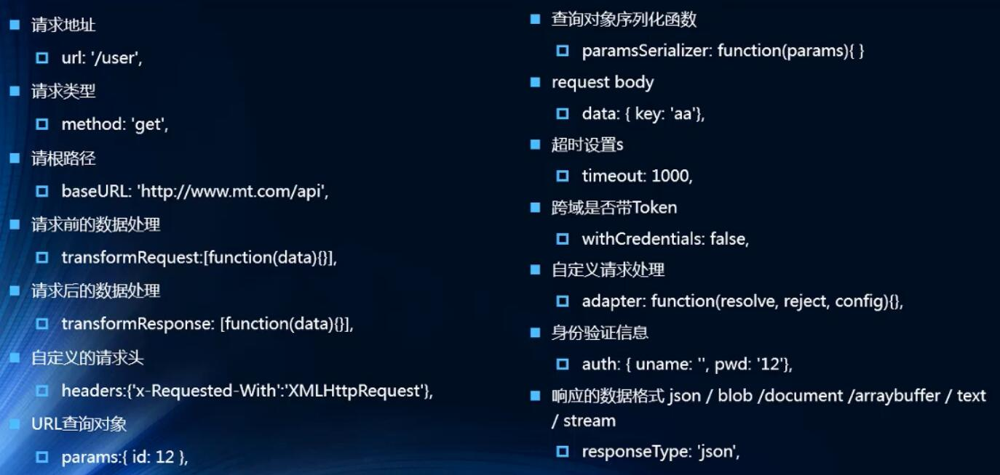

#网络
##安装和基本使用axios
安装命令：npm install axios --save

安装完成后使用import语句将axios导入即可使用

	import axios from 'axios'
axios使用的语法如下

	axios({
	  // url:'http://123.207.32.32:8000/home/data?type=sell&page=1',
	  url:'http://123.207.32.32:8000/home/data',
	  //params是针对get请求的参数拼接
	  params:{
	    type:'pop',
	    page:1
	  }
	  // method:'post'
	}).then(res=>{
	  console.log(res);
	})
axios其内部已经实现了Promise，在网络请求完成时已经自动调用了resolve方法，因此在axios网络请求完成后，可以自动将请求拿到的数据res在then方法中执行

##axios发送并发请求
当一次结果的处理数据需要两次或者多次axios请求时，其处理方式类似于Promise（详情见LearnVueJs08\01-Promise的使用\05-Promise的all方法的使用），使用axios的all方法，axios的all方法所需要传入的参数也是一个可迭代对象，一般为数组。该数组的元素分别为要执行的两个或多个网络请求。在all方法执行完毕后，可以执行其then方法（类似于Proomise），then方法所含的参数数组中的网络请求的所拿到的数据，results[0]为数组中第一个网络请求的数据，result[1]为数组中第二个网络请求拿到的数据，以此类推。可以在then方法中对拿到的数据做出处理

	//axios发送并发请求
	axios.all([axios({
	  url: 'http://123.207.32.32:8000/home/multidata'
	}
	),axios({
	  url:'http://123.207.32.32:8000/home/data',
	  //params是针对get请求的参数拼接
	  params:{
	    type:'pop',
	    page:1
	  }
	})]).then(results=>{
	  console.log('---1---');
	  console.log(results[0]);
	  console.log('---2---');
	  console.log(results[1]);
	})
axios对拿到的数据做出了处理，原本是封装为数组类型的results数组对象，axios可以将其直接切分为可使用的对象，其顺序与数组中数据元素对应，res1表示上述的results[0]，res2表示上述的results[1]，以此类推

	//axios发送并发请求
	axios.all([axios({
	      url: 'http://123.207.32.32:8000/home/multidata'
	    }
	),axios({
	  url:'http://123.207.32.32:8000/home/data',
	  //params是针对get请求的参数拼接
	  params:{
	    type:'pop',
	    page:1
	  }
	})]).then(axios.spread((res1,res2)=>{
	      console.log('---1---');
	      console.log(res1);
	      console.log('---2---');
	      console.log(res2);
	    })
	)

##axios全局配置
很多情况下所编写的url，超时时间timeout等等是重复，因此不用在每一个axios请求中都编写一次，而可以使用全局配置将其进行抽离。例如：

	axios.defaults.baseURL = 'http://123.207.32.32:8000'
	axios.defaults.timeout = 5000
因此在编写axios时，其url只需与baseURL拼接补充成完整的Url即可

	axios({
	  url:'/home/data',
	  //params是针对get请求的参数拼接
	  params:{
	    type:'pop',
	    page:1
	  }
	})
常用的配置选项有如下几种
	
1. 请求地址 （url）
2. 请求类型 （method）
3. 请求根路径 （baseUrl）
4. 请求前的数据处理 （transformRequest）
5. 请求后的数据处理 （transformResponse）
6. 自定义的请求头 （headers）
7. URL查询对象 （params）
8. 。。。

##axios模块封装
在实际的开发中，每一个页面都有可能发生网络请求，最笨拙的解决办法就是在每一个页面都引入axios并使用。这种方法虽然在开发中可行，但是尤其不利于后期维护，因为一旦axios不在维护，项目中不再使用axios时，将要到每一个页面进行修改。因此我们可以对axios进行封装，再在页面导入使用即可。

这里只展示了最终方案（最简洁的方案），方法的演变可以参考LearnVuexjs09中的main.js和network中的request.js

	export function request(config) {
	    return new Promise((resolve, reject)=>{
	        //1.创建axios实例
	        const instance1 = axios.create({
	            baseURL:'http://123.207.32.32:8000',
	            timeout:5000
	        })
	        instance1(config).then(res=>{
	            resolve(res)
	        }).catch(err=>{
	            reject(err)
	        })
	    })
	}
在request方法中，返回一个Promise，Promise中创建了axios实例，并调用，Promise实例的then方法在页面或其他js文件的调用中给出。

在调用之前需要将request导入

	import {request} from './network/request'
	
	request({
	  url:'/home/multidata'
	}).then(res=>{
	  console.log(res);
	}).catch(err=>{
	  console.log(err);
	})
由于axios的用法和Promise一样，因此request的代码可直接简写为下列（直接将调用的axios实例返回）

	export function request(config) {
	    //1.创建axios实例
	    const instance1 = axios.create({
	        baseURL:'http://123.207.32.32:8000',
	        timeout:5000
	    })
	    return instance1(config)
	}

##axios拦截器
axios拦截器分为请求拦截和响应拦截，请求拦截用于检测所发出的请求是否符合既定规则，拦截时请求将无法发送。响应拦截调用时，说明请求已经发送成功，是对于响应的内容做出的拦截。下面具体来看

1. 请求拦截

请求拦截的主要作用：①config中的一些信息不符合服务器的要求，对config做出修改；②每次发送网络请求时，都希望在界面中显示一个请求的图标；③某些网络请求，需要携带一些特殊的信息（比如登录token）

请求拦截为request对象，它的use方法需要两个参数，这两个参数均为函数，分别代表请求成功（前一个）和请求失败（后一个）的函数

	instance1.interceptors.request.use(config=>{
        console.log(config);
        return config
    },err=>{
        console.log(err);
    })

在请求成功的参数中，需要将数据进行返回，否则在执行了请求成功的函数后会接着执行请求失败的函数

2. 响应拦截

响应拦截为response对象，其使用方式和请求拦截类似，在响应成功时，需要将数据进行返回，否则在调用时无法拿到响应成功的数据

	instance1.interceptors.response.use(res=>{
        console.log(res);
        return res.data
    },err=>{
        console.log(err);
    })
响应成功一般直接返回res.data，在调用时取值不用再调用一层data取值