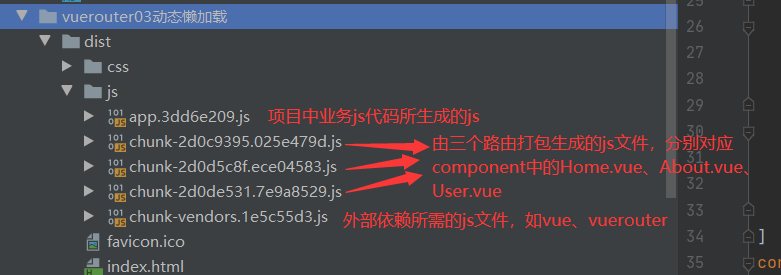

#Vue路由
##vue-router的安装和使用
step1:安装命令：npm install vue-router --save

step2:在模块化工程中使用它（因为是插件，所以可以通过Vue.use()老安装路由功能）

1.导入路由对象，并且调用Vue.use(VueRouter)

	import VueRouter from 'vue-router'
	//通过vue.use(插件)，安装插件
	Vue.use(VueRouter)
2.创建路由实例，并且传入路由映射配置

	//创建路由对象
	const routes = [
	    {
	        path: '/home',
	        component: Home
	    },
	    {
	        path: '/about',
	        component: About
	    }
	]
	const router = new VueRouter({
	    //配置路由和组件之间的应用关系
	    routes
	})
将创建的router对象导出，便于在其他页面使用

	//将router对象传入到vue实例
	export default router
3.在Vue实例中挂载创建的Vue实例

	  

	    <router-link to="/home">首页</router-link>
	    <router-link to="/about">关于</router-link>
	    <router-view></router-view>
 	  

step:使用vue-router的步骤

1.创建路由组件
2.配置路由映射：组件和路径映射关系
3.使用路由：通过<router-link>和<router-view>

其中<router-link>中的to属性指定了点击要获取的router组件的地址（和创建路由对象时定义的地址一致），<router-view>是要渲染的区域

###路径显示方式
默认的router的地址更改是以hash值更改的，因此更改的路径中会拼接一个#，例如http://localhost:8080/#/home，要使路径中没有#，可以使用html5的history更改路径。使用方式：在new VueRouter中添加mode属性，并赋值history：

	const router = new VueRouter({
	    //配置路由和组件之间的应用关系
	    routes,
		mode:'history'
	})

###渲染的标签类型
<router-link>渲染出的标签默认为a标签，想要改变其渲染出的标签类型，可以添加一个tag属性，并指定要渲染的标签类型，例如：

	<router-link to="/home" tag="button">首页</router-link>

###路径是否可返回
且地址的跳转方式默认为history的pushStack方式，因此在跳转之后还可以通过浏览器的返回按钮返回到上一层，要想使跳转之后不能使用浏览器的返回按钮返回，可以使用history的repleace方式，使用方法为：

	<router-link to="/home" tag="button" replace>首页</router-link>

###活跃的router-link的class值修改方式
可分为两种方式，一是直接在router-link标签上添加active-class属性，并自己给出属性值，该值将为活跃的router-link的class值

	<router-link to="/about" tag="div" replace active-class="active">关于</router-link>

当标签较多时，逐一修改会增加工作量，因此可以在创建路由对象时，在其中定义活跃的router-link的class值

	const router = new VueRouter({
	    //配置路由和组件之间的应用关系
	    routes,
	    mode:'history',
	    //定义处于活跃的router-link的class值
	    linkActiveClass:'active'
	})

###其他标签代替router-link标签
在渲染时，除了可以将router-link添加tag属性显示为其他的标签外，还可以将其他的标签包装为router-link，以button为例

	<button @click="homeBtn">首页</button>

在绑定的homeBtn方法中，可以通过代码的方式绑定路由vue-router

	homeBtn(){
          //通过代码方式修改路由vue-router
          //使用push是内部调用的pushStack方法，可以通过浏览器的返回按钮返回上层地址
          this.$router.push('/home')
          //使用replace是内部调用的replaceStack方法，不可以通过浏览器的返回按钮返回上层地址
          // this.$router.replace('/home')
          console.log('home');
      }

其中的$router所拿到的对象为router下创建的VueRouter对象const router = new VueRouter({})

##动态路由
###动态路径
在实际的开发使用中，路由的路径不一定是固定的，例如在登陆时，时常需要在路径上带上登录的userId，在创建路由时，在声明路由对象时，在path属性后面跟上要动态获取的值

	{
        path: '/user/:userId',
        component: User
    }
在页面挂在<router-link>时，使用v-bind:to动态绑定要补充在路径后的值。（知识点：v-bind中单引号括起来的值为固定值）

	<router-link :to="'/user/'+userId">用户</router-link>
所需要的userId在data中进行定义

	data(){
      return{
          userId:'zs'
      }
    }
###动态取值
当在vue-router的模板页面需要获取动态路径所跟的值时，可以利用computed计算属性，例如在页面要获取userId

	
{{ userId }}

在computed中定义userId

	computed:{
        userId(){
            return this.$route.params.userId
        }
    }
其中$route获得的是在创建路由对象routes中处于活跃状态的路由，params后面的参数是在定义path时，冒号后面跟的变量名userId

##路由的懒加载
当打包构建应用时，JavaScript包会变得非常大，影响页面加载。如果我们能把不同路由对应的组件分割成不同的代码块，然后当路由被访问的时候再加载对应的组件，这样就显得更加高效，即路由懒加载（用到时再加载）

懒加载的引用方式：

方式一：结合Vue的异步组件和webpack的代码分析

	const Home = resolve =>{require.ensure([''../components/Home.vue],()=>{
		resolves(require('../components/Home.vue'))
	})};

方式二：AMD写法

	const Home = resolve => require(['../components/Home.vue'],resolve);

方式三（推荐写法）：在ES6中更加简单的组织Vue异步组件和webpack的代码分割的写法

	const Home = () =>import('../components/Home.vue')

对于每一个要懒加载组件，都可以上面三种方式在页面引入，再使用npm run build的打包后，在dist的js文件夹下会形成对应的打包后的js文件

	const Home = () => import('../components/Home')
	const About = () => import('../components/About')
	const User = () => import('../components/User')

##路由的嵌套
在创建路由组件时，由于功能需要，可能需要在一个路由组件中嵌套另外一个路由，例如需要在首页显示新闻或消息。那么在创建首页路由对象时，需要在其中加入children属性（数组形式），其children属性中定义的就是嵌套的子路由

	 {
        path: '/home',
        component: Home,
        children:[
            {
                //子路由的路径前不用加/
                path: 'news',
                component: HomeNews
            },
            {
                path: 'message',
                component: HomeMessage
            }
        ]
    }

在页面显示时，需要在对应的Home.vue中加入<router-link>和<router-view>来显示嵌套的新闻或消息路由组件

	<template>
	    

	        <h2>我是Home</h2>
	        
我是Home内容

	        <router-link to="/home/news">新闻</router-link>
	        <router-link to="/home/message">消息</router-link>
	        <router-view></router-view>
	    

	</template>

需要注意的是，在创建路由时，路径只用写子路由组件的路径，不能加/，在将其挂载到页面时，<router-link>中的to属性中，要写入完整的路径

##传递参数
###使用<router-link>
传递参数主要有两种类型：params和query

1.params(在动态取值的动态路由中已经讲解)

①配置路由格式：/router/:id

②传递的方式：在path后面跟上对应的值

③传递后形成的路径：/router/123、/router/abc

2.query

①配置路由格式：/router，也就是普通配置

②传递的方式：对象中使用query的key作为传递方式

③传递后形成的路径：/router?id=123、/router?id=abc

在配置路由时，仍用普通路径，在将其挂在到页面时，以v-bind绑定对象（该对象可以定义在data中）

	<router-link :to="{path:'/profile',query:{name:'zs',age:18}}">档案</router-link>
在取值时，使用$route.query.name、$route.query.age进行取值，原理和params一样，$route得到的时当前处于活跃状态的路由

下列为定义在data中的方式

	data(){
      return{
          userId:'zs',
          profile:{
              path:'/profile',
              query:{
                  name:'ls',
                  age:18
              }
          }
      }
    }
使用query时请求的地址为：ocalhost:8080/profile?name=ls&age=18

###使用其他标签
用户使用params传递，档案通过query方式传递

	<button @click="userBtn">用户</button>
    <button @click="profileBtn">档案</button>
在其各自的方法中

	profileBtn(){
        this.$router.push({
            path:'/profile',
            query:{
                name:'ls',
                age:18
            }
        });
     },
    userBtn(){
        this.$router.push('/user/'+this.userId);
    }
params是以字符串拼接的方式，query是将路径和参数作为对象传递到push方法中