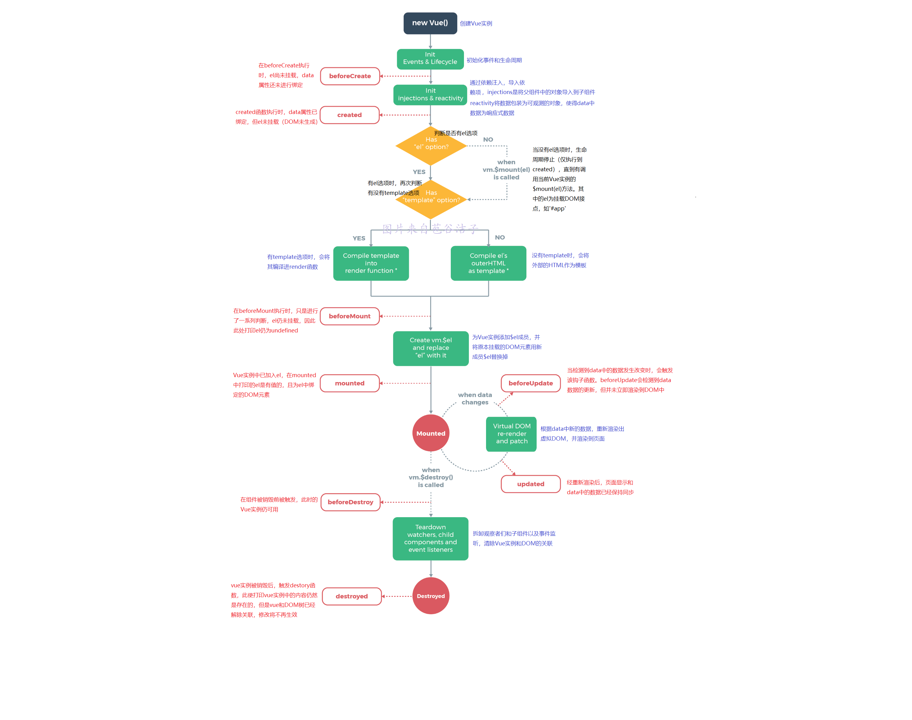
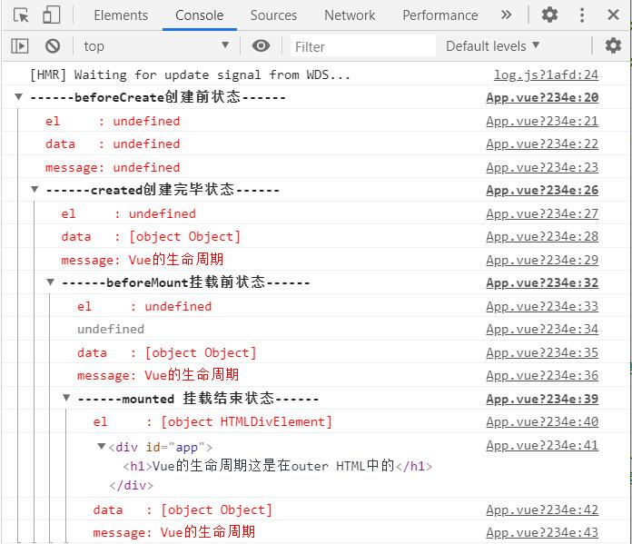
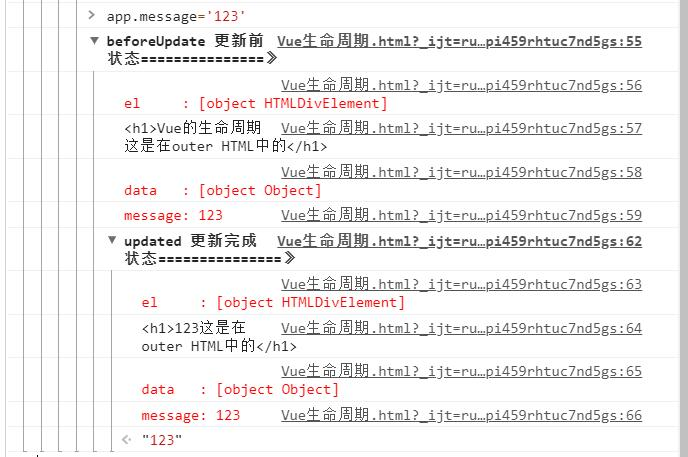
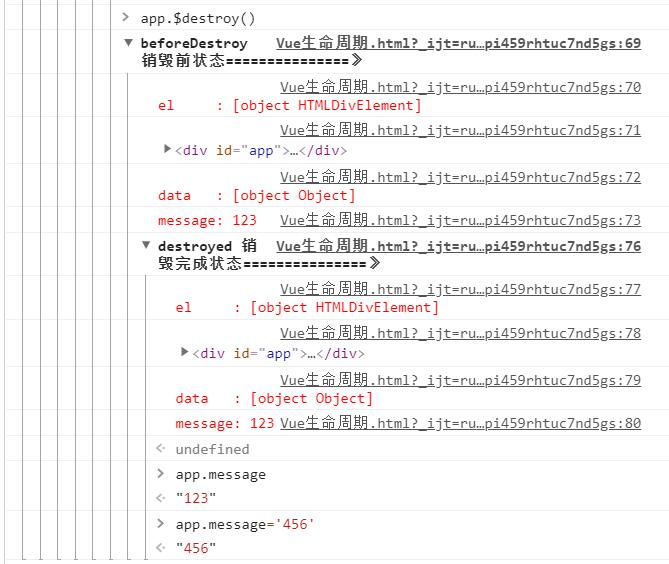

#vue生命周期
本文章参考https://segmentfault.com/a/1190000011381906

在Vuejs的官网中提供了一张Vue的生命周期图示（移步到：https://cn.vuejs.org/v2/guide/instance.html#%E7%94%9F%E5%91%BD%E5%91%A8%E6%9C%9F%E5%9B%BE%E7%A4%BA），相信很多小伙伴看到这张图示的时候跟我一样有点懵，虽然官网中提到不需要立马弄明白生命周期中所有的东西，但是你迟早有对这个东西好奇的一天。今天咱就来扒一扒其中的奥秘。

##生命周期是什么
铁子们对生命周期这个词应该不陌生了，Vue的每一个组件都是一个独立的个体，Vue的生命周期就是这个组件从**创建**、**数据初始化**、**渲染**、**更新**、**再渲染**再到最终被**销毁**的一系列过程。上图！

##Vue生命周期钩子函数
上图中已经对vue的各个生命周期中的行为做出了解释，下面结合代码来验证各个钩子函数

	<!DOCTYPE html>
	<html lang="en">
	<head>
	    <meta charset="UTF-8">
	    <meta name="viewport" content="width=device-width, initial-scale=1.0">
	    <meta http-equiv="X-UA-Compatible" content="ie=edge">
	    <title>vue生命周期学习</title>
	    
	</head>
	<body>
	

	    <h1>{{message+'这是在outer HTML中的'}}</h1>
	

	</body>
	
	</html>

打开浏览器的开发者工具，切换到console

此时打印的结果如下图所示：

###创建期间的生命周期钩子函数
1. beforeCreate

	可以观察到，此时el选项和data属性均未被创建，因此打印的结果均为undefined

2. created

	在beforeCreate和created之间，初始化了date属性，且将data包装为响应式数据，此时的Vue实例已经生成，但仍不能获取DOM元素，因此打印的data是有数据的，但el仍为undefined

3. beforeMount

	这一阶段仍获取不到具体的DOM元素，但vue挂载的根节点已经创建（上图为在Vue脚手架中执行结果，直接使用src引入vue的方式打印的el有值，但是message未被替换）

4. mounted

	在此阶段，DOM和data均已被渲染，上图中的<h1\>标签中message已经被data中message的值替换。mounted是使用率较高的钩子函数，因为数据和DOM树均已完成渲染，异步的操作一般情况下将会在mounted函数中编写
###运行时的生命周期函数
在运行时可以对data中的数据进行修改，修改后会触发下面两个钩子函数

1. beforeUpdate

根据打印结果显示data中的message已经被修改为123，但DOM中的message尚未同步，还是原来的值

2. updated

	数据的变更驱动DOM，在这个阶段DOM会和data中的message同步，打印结果中显示message和DOM中的message均为123

###销毁时的生命周期函数
在vue实例被销毁时，会触发下面两个生命周期函数

1. beforeDestory

执行到beforeDestory函数时，Vue实例进入销毁阶段，但此时Vue实例中的数据、方法、过滤器等仍然是可用的

2. destoryed

	Vue实例和DOM之间的绑定已经清除，实例中的data等还存在，但无法再进行修改（即修改将不再生效）

