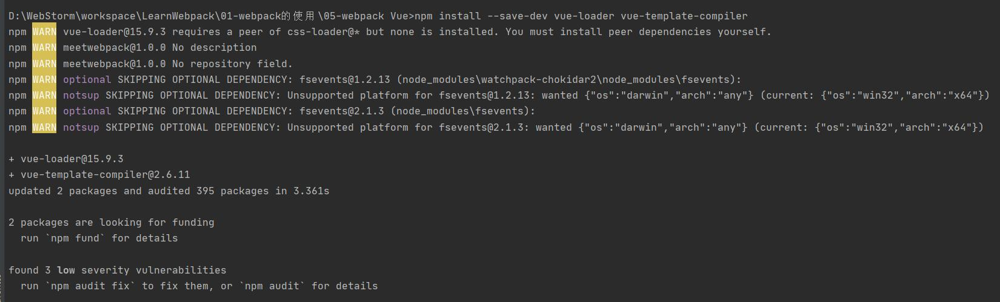
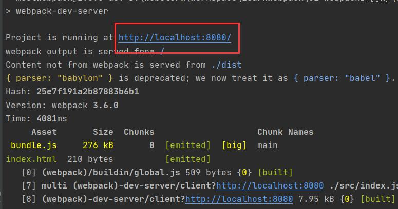
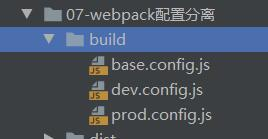

grunt/gulp和webpack有什么不同？

	grunt/gulp更加强调的是前端流程的自动化，模块化不是它的核心
	webpack更加强调的是前端流程的自动化，而文件压缩合并、预处理等功能是它的附带功能。
#webpack
##webpack打包过程

	webpack ./src/main.js ./dist/bundle.js（一般情况下main.js是入口文件）
使用webpack工具将./src/main.js进行打包，打包到./dist/bundle.js。webpack会自动处理模块之间的依赖，因此在打包./src/main.js之前会检查该文件中是否依赖其他的文件，并找到对应的依赖的文件进行打包

##webpack简化打包命令
编写webpack的配置文件webpack.config.js，存放在项目路径下，webpack.config.js配置文件的内容如下：

	//在终端执行webpack时，自动找到目录下的webpack.config.js文件，读取其中的入口和出口
	//导入全局中的path包(后)，赋值给path(前)
	const path = require('path')
	
	module.exports={
	    entry:'./src/index.js',  //规定webpack的入口
	    output:{  //规定webpack的出口，出口一般以对象的方式表示
	        path:path.resolve(__dirname,'dist'),  //路径，动态获取，path.resolve拼接路径，其中"__dirname"是node中的全局变量，保存的当前所在文件的路径
	        filename:'bundle.js'  //文件名
	    }
	}
终端执行直接webpack命令即可，无需再在终端指定入口和出口

##package.json
package.json文件中的"scripts"定义了npm run要执行的命令，例如

	"scripts": {
	    "test": "echo \"Error: no test specified\" && exit 1",
	    "build": "webpack"
	  	},
当执行npm run build时，相当于执行webpack命令。

"devDependencies"定义了开发时依赖，例如：

	"devDependencies": {
	    "webpack": "^3.6.0"
	  },
表明开发时依赖webpack的3.6.0版本

"dependencies"定义了运行时依赖，项目打包完成后还想用的东西定义在"dependencies"下

**注：在终端给出的命令都是用的全局安装**

因此在package的"scripts"中定义脚本命令，执行的是本地安装

##loader
webpack命令只能用于打包js文件，因此需要打包其他文件时，要安装对应的loader命令，例如css需要安装'css-loader'（使用npm命令安装），各个对应的loader安装和使用可查看文档https://www.webpackjs.com/loaders/

css-loader只用于加载css文件，因此还需导入style-loader才能使样式生效

	module: {
        rules: [
            {
                test: /\.css$/,
                //'css-loader'只负责将css文件进行加载，不负责解析
                //'style-loader'负责将样式添加到DOM中生效，否则样式加载不出来
                //使用多个loader时，从右向左读，例如下面先读'css-loader'，再读'style-loader'
                use: ['style-loader','css-loader' ]
            }
        ]
    }

##webpack配置vue
在后续的实际项目中也会使用到vue，因此不是开发时依赖，在安装时是应用命令：

	npm install vue --save
在使用vue之前，先引入：

	import Vue from 'vue'
vue在发布时，创建了两类版本

1.runtime-only

代码中不可以又任何的template，runtime-only没有包含任何对template编译的代码

2.runtime-complier

可以有template，因为有compiler可以用于编译template

使用import Vue from 'vue'直接引入是 ，默认是runtime-only版本，因此需要在webpack.config.js下使用resolves指定要引入的版本：（resolves和entry同级）

	resolve: {
        //alias 别名，说明以vue结尾的文件指向了具体的文件夹"vue/dist/vue.esm.js"
        //在执行时用引入的vue文件就是"vue/dist/vue.esm.js"（该文件在node_modules下）
        alias:{
            'vue$':"vue/dist/vue.esm.js"
        }
    }
##抽取vue文件
在实际的开发中，index.html中智慧存在一个div，且div中没有任何内容

	

页面中的内容，在index.js文件中给出，在js文件的Vue实例中，用template引入要替换的内容（使用组件的概念，注册组件进行替换，template中定义的内容将替换掉el选择器所指向的标签）

	const cpn = {
	    template:`
	        

	            <h2>{{ message }}</h2>
	            <button @click="btnClick">按钮</button>
	            <h2>{{ name }}</h2>
	        

	    `,
	    data(){
	        return{
	            message:"hello Vue",
	            name:'zs'
	        }
	    },
	    methods:{
	        btnClick(){
	
	        }
	    }
	}

	const app = new Vue({
	    el:"#app",
	    //template中的内容，会替换掉el选择器选中的标签，即在本示例中，template中的内容会替换html中的div
	    template:'<cpn></cpn>',
	    components:{
	        cpn
	    }
	})
这种方式虽然简化了html中的内容，但是使js文件的内容可读性降低，因此可以将template抽取到vue文件中，在js文件中进行引入使用。

1.创建vue文件，会自动生成template，script,style scoped

2.在template标签中tianjia要替换的内容

	<template>
	    

	        <h2 class="title">{{ message }}</h2>
	        <button @click="btnClick">按钮</button>
	        <h2>{{ name }}</h2>
	        <App></App>
	    

	</template>
3.在script标签中添加定义的数据方法等

	
需要注意的是，为了能使在其他的页面能够引用定义的vue文件，需要将文件内容导出，采用export default的方式导出，将data、methods等定义在export中，当前页面要引入其他的组件时，也可以使用import将其他组件导入，并引用

4.在style scoped标签中定义template中标签的样式

	<!--定义样式-->
	
在引入vue文件时要安装vue-loader，使用命令：

	npm install vue-loader vue-template-compiler --save-dev

若vue文件中有使用style样式，还要安装css-loader模块

##plugin
###生成版权信息的plugin
在webpack.config.js中导入webpack模块

	const webpack = require('webpack')
并添加plugins属性，在属性中创建版权信息的plugin

	plugins:[
        new webpack.BannerPlugin("版权最终归zs所有"),
    ]

###打包html的plugin
使用webpack进行打包时，没有自动打包index.html，可以使用html-webpack-plugin插件将index.html进行打包

首先需要安装html-webpack-plugin插件，使用命令npm install html-webpack-plugin --save-dev

安装完成后在webpack.config.js中进行配置，在webpack.config.jd导入html-webpack-plugin模块

	const HtmlWebpackPlugin = require('html-webpack-plugin')
在plugin中引用

	new HtmlWebpackPlugin();
未添加参数的是默认方式，在执行npm run build后会在dist文件夹下生成bundle和index.html，且index.html中会自动引用bundle.js，但页面为空页面

	<body>
  		
	</body>
要为打包的index.html页面添加内容，可以将原本的index作为template传入HtmlWebpackPlugin中

	new HtmlWebpackPlugin({
            template: 'index.html'
        }),
再执行npm run build生成的index.html页面就会有默认内容了

	<body>
	  

	  

	  
	</body>

###js压缩的plugin
原本的打包的js文件可读性高，但占用内存较多，可以使用uglifyjs-webpack-plugin插件，对js文件进行简化（去掉换行和复杂的参数声明），uglifyjs-webpack-plugin插件的安装命令

	npm install uglifyjs-webpack-plugin@1.1.1 --save-dev
使用方式同html-webpack-plugin

	const uglifyJsWebpackPlugin = require('uglifyjs-webpack-plugin')
	
	new uglifyJsWebpackPlugin()

###搭建本地服务器
在以上的学习中，在打包完成后，生成的文件都存放在磁盘中，每次运行需要手动到dist目录下执行index.html，且每次更改代码后，需要重新使用npm run build进行打包，为俭省操作，可搭建本地服务器，生成的文件存放于内存中，读取速度更快，且可以实时刷新

安装webpack-dev-server插件，使用命令：（此处指定了版本，webpack-dev-server的版本和webpack的版本有关联，因此在安装时最好指定版本）

	npm install webpack-dev-server@2.9.3 --save-dev
安装完成后需要到webpack.config.js中进行配置，配置的内容和plugin为同一级，其中contentBase指定了要服务的文件夹，inline的值为boolean型，指定是否开启实时监听。

	devServer:{
        //指定要服务的文件夹
        contentBase:'./dist',
        //开启实时监听（实时刷新）
        inline:true
    }
在执行时可以用相对路径进入node_modules中找到对应的文件和命令执行，也可以在package.json文件中的script添加指令

	"dev": "webpack-dev-server"
在执行时，直接使用npm run dev即可打包发布。打包完成在终端有访问地址，点击即可访问页面

若想执行npm run dev命令后直接访问页面，在script中定义命令如下

	"dev": "webpack-dev-server --open"

###分离配置文件
在实际的开发中，需要配置的内容将会很多，因此可以将原本的webpack.config.js配置文件分离为多个文件进行管理

在base.config.js中存放的是公共配置文件，在pord.config.js中存放的是生产时需要的配置，在dev.config.js中存放的是开发时需要的配置。

生产和开发配置页面需要引入的公共的配置，需要安装webpack-merge模块（安装命令为npm install webpack-merge），再将webpack-merge和base.config.js在配置文件中导入

	const webpackMerge = require('webpack-merge')	
	const baseConfig = require('./base.config.js')
再导出配置信息时，将base.config和生产时或开发时需要的配置一起导出

	module.exports = webpackMerge(baseConfig,{
	    devServer:{
	        //指定要服务的文件夹
	        contentBase:'./dist',
	        //开启实时监听（实时刷新）
	        inline:true
	    }
	})
由于这里的配置文件存放在build目录下，不是直接存放于根目录下，因此直接执行npm run build或者npm run dev会找不到路径，需要在package.json中修改script中定义的命令为

	"build": "webpack --config ./build/prod.config.js",
    "dev": "webpack-dev-server --config ./build/dev.config.js"